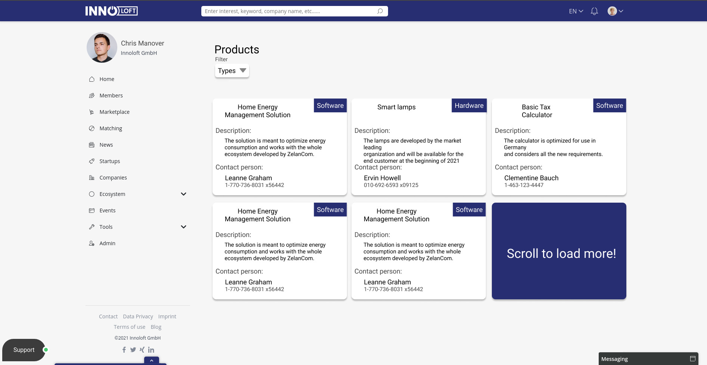
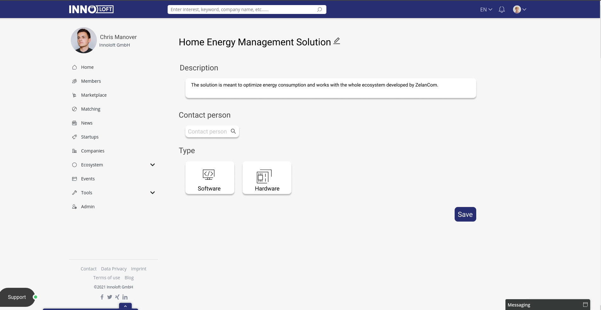

# Backend-Application
## Instructions
Please stick to the following instructions on how to submit your application:
1. Read the whole README
2. Fork our repository
3. Add your solution to your repository
4. Create a pull request to our repository

Also note down in the end how many hours it took to complete (roughly). **Please do not spend more than 6 hours for the whole task.**

Thank you very much!

## Main Task
Develop the first version of the products module. It should be possible to fetch all the products, a single one, add a new product, edit and delete it. Requirements are described via the mockups images below and should be derived from them.

### Database View

### Create/Edit View

### Clarification
* You **don't** have to build the frontend. Only the api requests like f.e. `GET /products/`.
* Top navigation, menu on the left, etc. are not part of this task. This is only about the product module.
* Filtering by product types should be possible to perform with multiple types selected.
* Pagination should be added in GET all request to enable loading more products on scroll.

## Technical Requirements
* Project
    * [ASP.NET Core web API application](https://docs.microsoft.com/en-us/aspnet/core/tutorials/first-web-api?view=aspnetcore-3.1&tabs=visual-studio). Prefer version 3.1.
* Database
    * Use SQLite or MySQL
        - When using MySQL, please add setup instructions
    * Use EF Core ORM framework to work with database
* Tests project
    * At least one unit test should be written (even the simplest one).
    * Prefer [xUnit](https://xunit.net/)
* Controller should contain POST,DELETE,UPDATE and two GET methods
* Project should be setup to run as a docker container - `Dockerfile` is required
* Use [Automapper library](https://automapper.org/) to map models to view models
* Attach user object
    * GET by id request: product should include the user object
      * make an api request to user api (https://jsonplaceholder.typicode.com/users/1)
    * the POST/PUT request will include a `userId` which is the owner of the product

## Bonus
The following points are optional but give additional credit:
* Avoid [anemic domain model](https://www.martinfowler.com/bliki/AnemicDomainModel.html)
* Caching
    * redis (or memcached)
* Test Coverage
* Get all products request should include the user object
* basic JWT Authentication
    * enalbe only the owner of the product to edit / delete the product
* Setup CORS to allow working with deployed service from localhost 